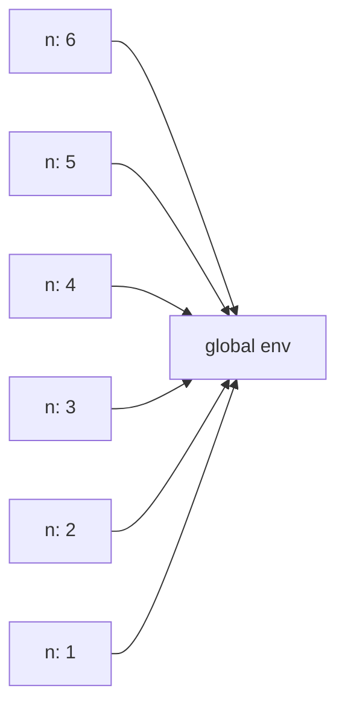
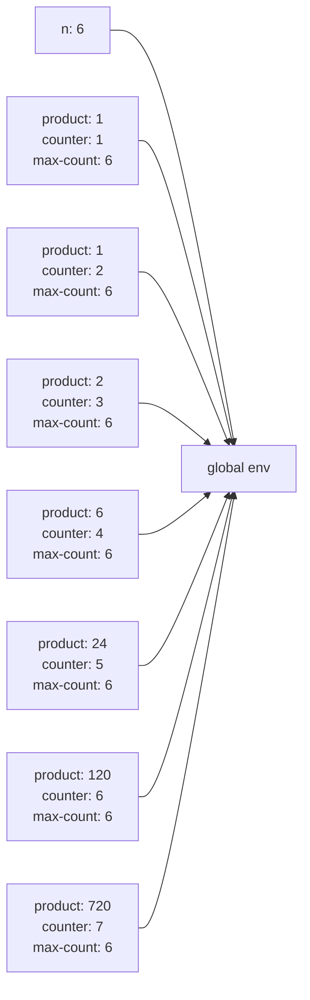

Recursive version:

```mermaid
graph LR
  G[global env]
  F1[n: 6] --> G
  F2[n: 5] --> G
  F3[n: 4] --> G
  F4[n: 3] --> G
  F5[n: 2] --> G
  F6[n: 1] --> G
```

Iterative version:

```mermaid
graph LR
  G[global env]
  F[n: 6] --> G
  F1[product: 1<br>counter: 1<br>max-count: 6] --> G
  F2[product: 1<br>counter: 2<br>max-count: 6] --> G
  F3[product: 2<br>counter: 3<br>max-count: 6] --> G
  F4[product: 6<br>counter: 4<br>max-count: 6] --> G
  F5[product: 24<br>counter: 5<br>max-count: 6] --> G
  F6[product: 120<br>counter: 6<br>max-count: 6] --> G
  F7[product: 720<br>counter: 7<br>max-count: 6] --> G
```
